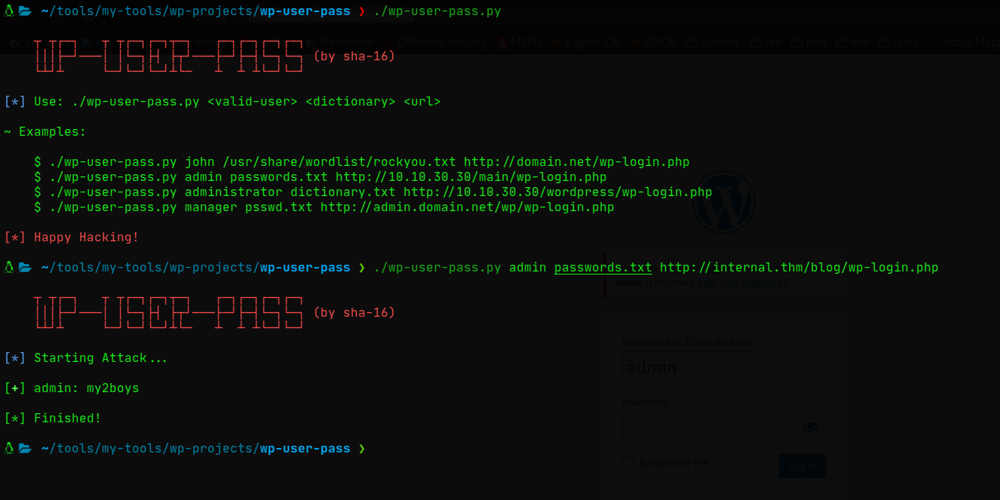

# WpUserPass
Esta es una herramienta que te permite hacer un ataque de fuerza bruta a un panel de login de WordPress teniendo como requisito único: 
* **Un usuario válido**. 


La herramienta aún está en testeo, así que no esperes a que esté libre de bugs. Fuera de eso te animo a probarla ⚡🤞

## Instalación y uso ⚡
```bash 
$ git clone https://github.com/sha-16/wp-user-pass.git
$ cd wp-user-pass/
$ chmod +x wp-user-pass.py
$ ./wp-user-pass.py
```

## Ejecución 💥



## Punto a tener en cuenta ⚡ 
* Este programa no posee funcionalidades que le permitan bypassear restricciones (restricciones en número de solicitudes, WAF, número de intentos de inicio de sesión, etc). 

## Motivos de la creación 💥 
* Practicar mis habilidades con Python3.
* Crear una herramienta que pueda servir como aporte para la comunidad. 
* Marcar un punto de referencia con código base para proyectos más grandes de otras personas.

## Problemas 
A la hora de que el programa encuentra una contraseña válida para el usuario, esta te hace perder el cursor de la terminal. Para corregir esto de momento, ejecuta: 
```bash
$ tput cnorm
```

**Nota:** cualquier bug o fallo que encuentres me gustaría que me lo hicieras saber, me ayudarías mucho 🤞❤

### Happy Hacking!❤⚡
